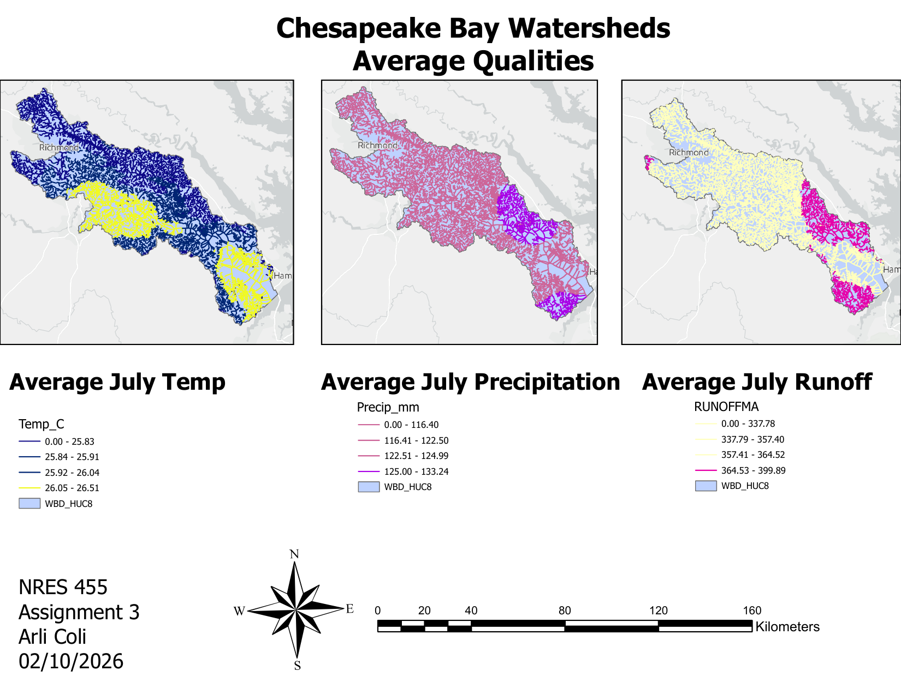
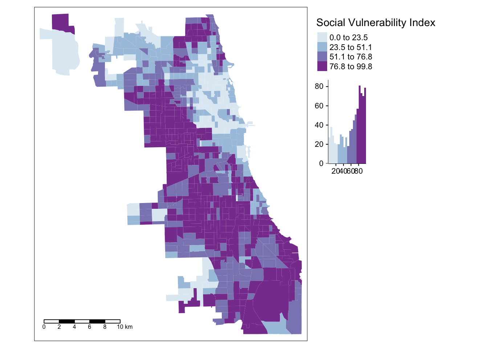
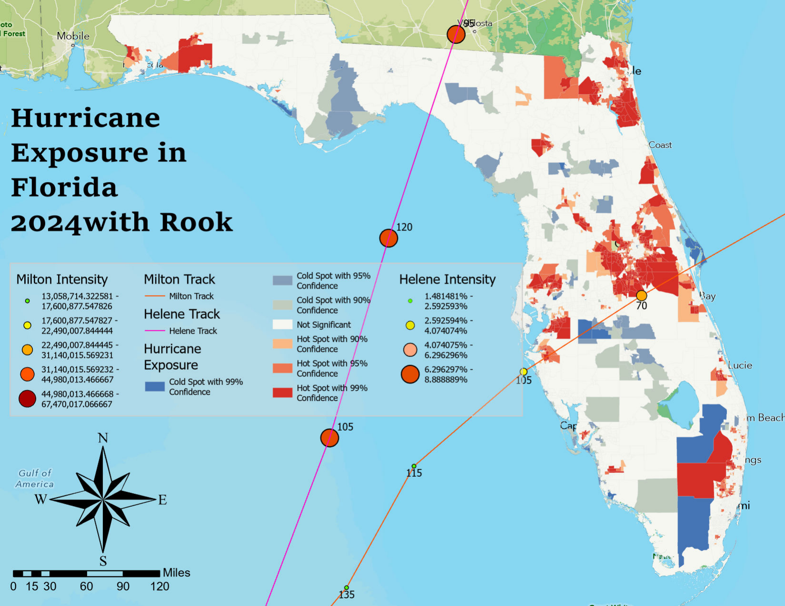
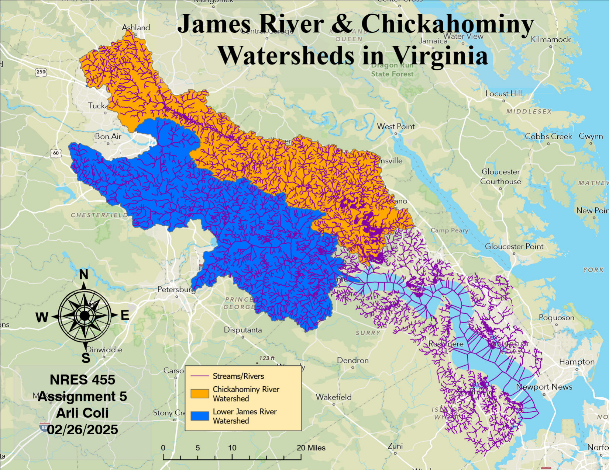
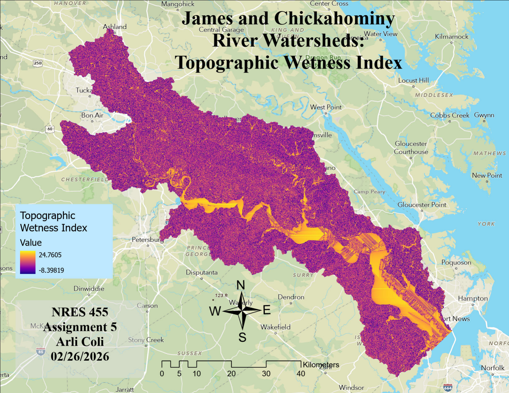

<style>
body { background-color:#f4f7f2; color:#26382f; }
h1, h2, h3 { color:#285943; }
h1, h2 { border-bottom:2px solid #7fa38b; padding-bottom:6px; }
a { color:#347a59; }
img { border:1px solid #c7d5ca; padding:5px; background:white; }
</style>

# About Me

I am a Geography and GIS graduate from the **University of Illinois Urbana-Champaign** with experience in GIS data management, cartography, spatial analysis, field data collection, utility mapping, and geospatial visualization.

I enjoy using GIS to turn spatial data into maps and tools that can support infrastructure, environmental work, planning, and everyday decision-making.

# Professional Experience

## GIS Paraprofessional | Forest Preserve District of DuPage County

As a GIS Paraprofessional, I work alongside the GIS Coordinator to maintain and update GIS data for preserve assets and utilities. My work includes collecting, digitizing, and updating **solar infrastructure, water utilities, culverts, and other preserve assets** using ArcGIS Pro, ArcGIS Online, and Trimble GNSS equipment.

I also work with **AutoCAD plans, construction drawings, and preserve layouts**, including georeferencing plans and using them to update GIS features. Along with utility mapping, I create and update **visitor information maps and preserve layouts** for public and internal use throughout the district.

**Software:** ArcGIS Pro | ArcGIS Online | ArcGIS Enterprise | Trimble GNSS | AutoCAD | Field Maps

# Selected GIS Projects

## Chesapeake Bay Watersheds

Compared watershed characteristics including average July temperature, precipitation, and runoff.

```{r chesapeake, echo=FALSE, out.width="100%"}

```

**Skills:** Watershed Analysis | Cartography | Spatial Data

---

## Chicago Social Vulnerability Index

Mapped the Social Vulnerability Index across Chicago census tracts to visualize geographic patterns in community vulnerability.

```{r chicago, echo=FALSE, out.width="80%"}

```

**Skills:** R | Spatial Data | Thematic Mapping

---

## Hurricane Exposure in Florida

Analyzed hurricane exposure associated with Hurricanes Milton and Helene using storm tracks, intensity information, and spatial hot and cold spots.

```{r hurricane, echo=FALSE, out.width="100%"}

```

**Skills:** ArcGIS Pro | Hot Spot Analysis | Spatial Analysis

---

## James River & Chickahominy Watersheds

Mapped the James River and Chickahominy watershed systems in Virginia along with their stream and river networks.

```{r watersheds, echo=FALSE, out.width="100%"}

```

**Skills:** Hydrology | ArcGIS Pro | Cartography

---

## Weather Stations & Watershed Zones

Mapped weather stations, stream networks, and watershed zones and compared their areas in square kilometers.

```{r weather, echo=FALSE, out.width="90%"}
knitr::include_graphics("images/weather-stations-zones.png")
```

**Skills:** R | Spatial Analysis | Cartography

---

## Topographic Wetness Index

Created a Topographic Wetness Index visualization for the James and Chickahominy River watersheds to show terrain-related patterns in potential soil moisture.

```{r twi, echo=FALSE, out.width="100%"}

```

**Skills:** Raster Analysis | Terrain Analysis | ArcGIS Pro

# Skills & Software

### GIS
ArcGIS Pro | ArcGIS Online | ArcGIS Enterprise | Experience Builder | Field Maps

### Programming & Data
Python | R | SQL | GeoPandas

### Field & CAD
Trimble GNSS/GPS | AutoCAD | Georeferencing | Utility Mapping | GIS QA/QC

### Cartography
Visitor Information Maps | Thematic Mapping | Map Layouts | Spatial Visualization

# Contact

**LinkedIn:** [https://www.linkedin.com/in/arli-c-79309a20b]

**Email:** arcoli50@outlook.com

---

*Arli Coli | GIS & Geospatial Portfolio | 2026*


